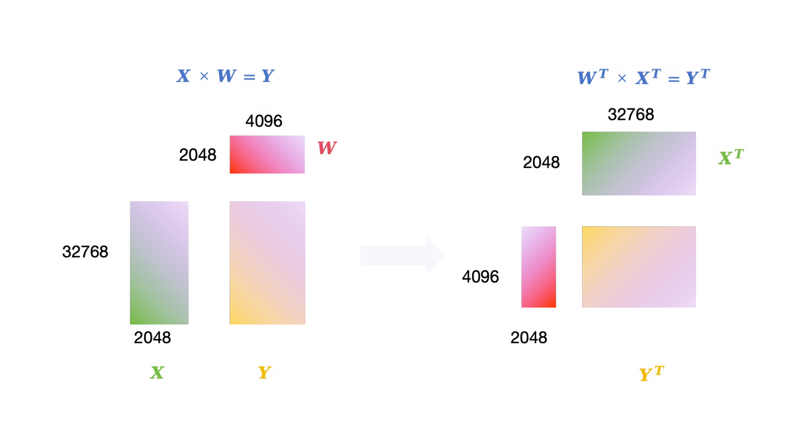

# Spatha Matrix Multiplication Acceleration Project

## Introduction
This project focuses on the matrix multiplication of $X \times W = Y$ where $X$ is a **dense matrix** and  $W$ is a **sparse matrix**. The key transformation applied is converting the multiplication to $W^T \times X^T = Y^T$, and then utilizing the capabilities of the `spatha` library to accelerate this computation.



### Why Use Spatha Library?
`spatha` library offers support for The **V:N:M** (VENOM) format, which allows for the execution of arbitrary N:M ratios on Sparse Tensor Cores (SPTCs). Typically, SPTCs natively support only 2:4 patterns (indicating 50% sparsity). By employing the VENOM format, Spatha enhances the flexibility and efficiency of sparse matrix operations on supported hardware.

### Why Transpose?
The Sparse Tensor Cores used in Spatha are optimized for operations where a sparse matrix multiplies a dense matrix. To align with this hardware optimization when a dense matrix needs to multiply a sparse matrix, a transposition approach is utilized. By transposing both $X$ and $W$, the multiplication $W^T \times X^T$ fits the hardware's operational design. The resultant matrix $Y^T$ is then transposed back to obtain the desired result $Y$.

## Installation and Execution

### Requirements
- **Python:** Version 3.12.4
- **CUDA:** Version 12.2.2
- **PyTorch:** Version 2.3.1
- **GPU:** GPU with Sparse Tensor Cores(Ampere or Hopper architecture)

### Installation
```bash
git clone https://github.com/HaoWang9909/DenseSparseMM.git
conda create -y --name test 
conda activate test  
conda install pytorch torchvision torchaudio pytorch-cuda=12.1 -c pytorch -c nvidia
pip install -r requirements.txt
cd sten
pip install .
```

### Quick Start

```bash
conda activate test
./intall_v64.sh
```
Open the Example_notebook.ipynb and run the cells.

### How to Use
To use this project, you need to install the `spatha` library specific to your configuration based on the value of `V` (VENOM format specification).

1. **Determine the value of `V`:** 
   - This value (e.g., 64 or 128) determines the specific sparse matrix format and related optimizations.

2. **Install the appropriate version of `spatha`:**
   - If `V` equals 64, run the following command in your terminal:
     ```bash
     ./install_v64.sh
     ```
   - If `V` equals 128, run the following command in your terminal:
     ```bash
     ./install_v128.sh
     ```
3. **Perform matrix multiplication:**
   - Follow the instructions provided in the notebook to execute matrix multiplication operations using the installed `spatha` library.

# References
- [Spatha Github](https://github.com/UDC-GAC/venom)
- [Spatha Paper](https://arxiv.org/abs/2310.02065)